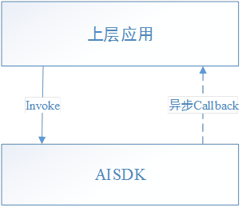
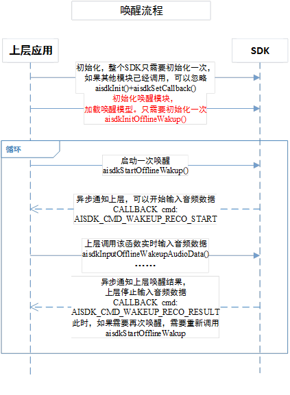
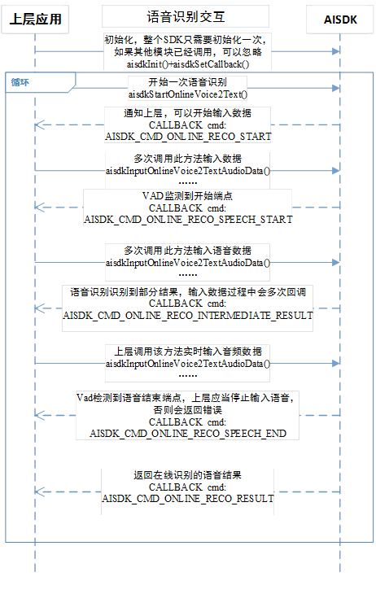
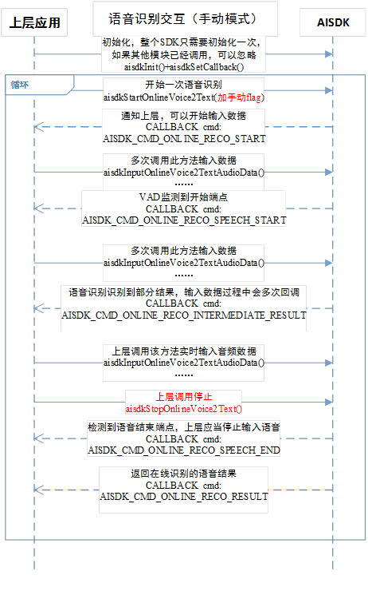
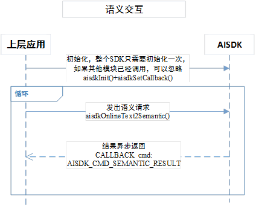
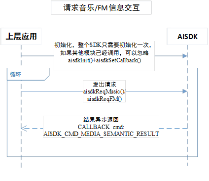
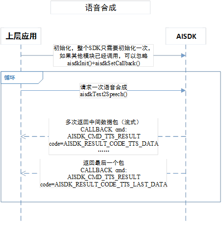

# 概述

本文档是叮当设备端的Linux平台SDK接入指引，主要包括在线语音识别、在线语义理解、在线语音合成以及离线语音唤醒等功能，其中语音识别和语音合成均为流式接口。

# 名词解释

# 编译运行环境
##运行硬件要求：
###CPU
-  位数：32位、64位
-  需要有浮点运算单元
-  频率不做要求，但建议单核1GHz以上，频率低，CPU占用会更高。
       参考：树莓派3上运行压力测试， 批量语音唤醒平均占用13.80%（大模型），批量语音识别平均占用25.40%，批量语音识别同时语音唤醒（大模型）平均占用40.40%。
        语音唤醒小模型CPU占用会大幅度降低。
-  支持平台：mips、arm、x86.

### 内存：
- 建议20M以上。 参考：树莓派3上运行（1G RAM）， SDK平均占用10M内存（RES），峰值12M。

### 磁盘空间：
- SDK：建议预留10MB空间，基础能力SDK占用5MB左右（包括唤醒库和模型），语音交互SDK占用6MB左右（包括唤醒库和模型）。
- 日志：如果开启日志，额外最多占用20MB磁盘空间。

##编译环境要求：
- Linux系统， 内核2.6以上
- 编译环境: 
  - GCC 4.6以上（不带语音唤醒功能）
  - GCC 4.8以上（带语音唤醒功能）

# 字符编码
默认情况下，传入SDK的文本参数和SDK返回的文本结果，为 UTF-8 编码。

# 输入音频
语音识别和离线唤醒需要的输入音频格式一致：
| 项目         | 要求            |
| :----------- | :-------------- |
| 音频格式     | PCM格式         |
| 采样精度     | 16位            |
| 采样率       | 16000Hz         |
| 声道         | 1声道（单声道） |
| 字节序       | 小端            |
| 单包建议大小 | 1600字节        |

# 输出音频
语音合成输出的音频格式如下：
（TODO：未来支持MP3）
| 项目         | 要求            |
| :----------- | :-------------- |
| 音频格式     | PCM格式         |
| 采样精度     | 16位            |
| 采样率       | 16000Hz         |
| 声道         | 1声道（单声道） |
| 字节序       | 小端            |
| 单包建议大小 | 1600字节        |

# 接入指南

##1. 准备工作
 - 建立一个工作目录，该目录应当是可读写的，SDK在运行过程中产生的日志和数据会生成到这个目录中，如果不可读写，将会影响语音和语义识别效果。
 - 把res目录下的唤醒模型keywords_model目录复制到SDK可以访问的目录中（建议放在工作目录下）。
 - 把libs文件夹内so动态库复制到编译器可以找到的目录，否则编译时会提示找不到符号的错误。
 - 把include下头文件复制到项目中。

##2. 配置文件Config.conf
配置文件可以配置SDK的功能，比如配置网络环境，但功能配置不是必须的（SDK内部会有默认值），必填的是接入方的相关信息，用于SDK获取相关信息上报给服务端标识对应的终端，把配置文件放到上面建立的工作目录中。
配置文件必填的信息如下：

    <conf>
        <qua>
            # 请按注释修改内容
            qua_version=3
    
            # 系统平台
            #  ADR    Android平台
            #  IOS    iOS平台
            #  LINUX  Linux平台
            platform=LINUX
    
            # 厂商简称，字母、数字、下划线形式的
            vendor=YourCompanyName
    
            # 产品简称，字母、数字、下划线形式的
            product=speaker
    
            # 版本
            #  GA	预览版
            #  RC	正式版
            #  B1	Release candidate
            #  B2	Beta1
            #  …	Beta2
            #  B9	…
            #  LAB	Beta9
            version=GA
            # 版本号。主版本.子版本.[修正本].[build]，如5.2.0.0880
            version_num=1.0.0.0
            # 包名。与Android包名一致，公司网址倒写，然后加上产品简称即可。
            package=com.YourCompanyName.speaker
    
            # 设备类型：SPEAKER	音箱
            #          PHONE	手机
            #          CAR	    车机
            #          TV	    电视
            device=SPEAKER
        </qua>
    </conf>

##3. SDK初始化
初始化方法是在`include/aisdk_common_api.h`中声明的。

     /**
     * @brief SDK初始化函数
     * @param in folderPath 配置路径z
     * @param in appKey 应用的appkey，需要从平台申请
     * @param in accessToken 应用的access token
     * @return <em>0</em>:ok others:fail。 错误码定义见AISDK_ERROR_*常量
     * @note
     */
    AISDK_API_EXPORTS int aisdkInit(const char* folderPath, const char* appKey, const char* accessToken);
① folderPath 为SDK的工作目录的路径。
② appKey和accessToken均为在叮当平台新建应用的时候生成的，**必须传递**。

## 4. 设置回调方法
SDK返回给接入方的数据是通过异步交互完成的，接入方需要注册一个回调方法，接收SDK的异步的回调。
注册回调的接口如下：

    /**
     * @brief 设置回调函数
     * @param in callbackPtr 回调函数指针
     * @return
     * @note
     *
     */
    AISDK_API_EXPORTS void aisdkSetCallback(AISDK_CALLBACK callbackPtr);

回调方法的原型为：

    /**
     * @define 设置回调函数原型
     * @param cmd 当前的指令，指示参数data的内容解析方式和含义, 定义由各模块指定(AISDK_CMD_*开头的常量)
     * @param data 数据存储区域
     * @param len data的长度
     * @param userData 传回用户自定义数据，此数据是在用户发起请求是传入的
     * @param userDataLen 用户自定义数据长度
     * @param extraData 附加数据，如果没有返回NULL
     * @param extraDataLen 附加数据长度
     * @warning 不要在回调函数内做任何阻塞的操作。否则会阻塞其他回调。
     *
     * 回调命令
     * @see 参见各接口头文件的AISDK_CMD_*常量定义
     *
    */
    typedef void (AISDK_CALL_CONV *AISDK_CALLBACK)(int cmd, char* data, int dataLen, void* userData, int userDataLen, void *extraData, int extraDataLen);

SDK所有接口都通过这个回调方法异步返回结果，回调带有cmd、data等参数。cmd用来区分不同类型的回调，data用于回传结果。
例如cmd= AISDK_CMD_SEMANTIC_RESULT表示语义请求已经有结果，data为返回的语义和服务的JSON数据。

**注意，在回调方法中的实现不能执行耗时的操作，否则会阻塞SDK的后续流程。**

## 5. 传递设备信息给SDK
接入方需要把设备信息（productId和DeviceServialNumber）传给SDK，其中productId是设备厂商的标识，DeviceServiceNumber是设备的唯一标识，后续业务服务端会依赖于这些信息，因此设备信息是必须传递给SDK的。

    /**
     * @brief 向SDK传递设备信息。
     * @note 当收到CMD:AISDK_CMD_RECV_GET_INFO时应该调用此函数
     * @param deviceSerialNum 设备序列号，应能唯一识别一台设备
     * @param productId 产品ID。叮当平台分配
     * @param apName 出厂设备开启的AP SSID。
     * @param netCard 网卡名，如果网卡没有特殊配置，传NULL即可，默认是wlan0。
     * @param guid 默认传NULL即可。
     * @return 0表示成功，其他表示失败
     */
    AISDK_API_EXPORTS int aisdkRecvSendDeviceInfo(const char* deviceSerialNum, const char* productId, const char* apName, const char* netCard, const char* guid);        
方法中的其他参数没有特殊需求不是必须的。

## 6. 调用自己需要使用的功能接口，下面将各自说明。

# 离线语音唤醒
## 1. 概述
离线唤醒的接口位于`include/aisdk_wakeup.h`中，唤醒识别依赖动态库`libtwakeup.so`，默认唤醒词为“叮当叮当”。
## 2. 回调cmd
| CMD                            | 说明                                       |
| :----------------------------- | :----------------------------------------- |
| AISDK_CMD_WAKEUP_RECO_START    | 开始语音唤醒流程，接入方应用可以开始输入语音数据 |
| AISDK_CMD_WAKEUP_RECO_RESULT   | 语音唤醒流程结束，返回结果                 |
| AISDK_CMD_WAKEUP_RECO_ERROR    | 语音唤醒出错。语音唤醒流程结束             |
| AISDK_CMD_WAKEUP_RECO_CANCELED | 语音唤醒出错。语音唤醒流程结束             |
## 3. 交互流程
### 3.1 正常流程

首先需要初始化唤醒模块：

    /**
     * @brief 唤醒初始化，只需要初始化一次。
     * @param modelPath 唤醒词模型路径
     * @return 0：ok，other：fail。 错误码定义见AISDK_ERROR_*常量
     */
    AISDK_API_EXPORTS int aisdkInitOfflineWakup(const char * modelPath);
其中modelPath为唤醒模型`keywords_model`的路径。

接入方应用（如带有语音唤醒功能的音箱）在启动完毕后可以启动一次唤醒流程（aisdkStartOfflineWakeup()）。收到cmd=AISDK_CMD_WAKEUP_RECO_START后，接入方应用可以开始录音并实时向语音唤醒模块输入语音数据，语音唤醒模块会检测语音数据流中的唤醒语音。当检测到唤醒语音，SDK将会发出cmd=AISDK_CMD_WAKEUP_RECO_RESULT的回调，并带有唤醒结果，这样就完成了一次唤醒识别流程。

此时，接入方应用应该停止向唤醒模块输入录音，建议先进行语音识别的流程，语音识别流程完毕后重新开启一次唤醒流程（aisdkStartOfflineWakeup()）继续监听用户的唤醒输入。

当接入方应用调用aisdkCancelOfflineWakeup时就取消本次唤醒识别流程，此时SDK会发出cmd=AISDK_CMD_WAKEUP_RECO_CANCELED回调。

### 3.2 异常处理
开始唤醒流程后，发生引擎错误会产生cmd=AISDK_CMD_WAKEUP_RECO_ERROR的回调，接入方应当停止输入音频。可以尝试重新开启一次唤醒（aisdkStartOfflineWakeup()）。

## 4. 回调命令的数据格式
### 4.1	AISDK_CMD_WAKEUP_RECO_RESULT回调

data数据格式如下：

    {
       "rc":0,	   
       "result":{
           "code":0，//0表示识别到唤醒词，1表示取消
           "data":"ding1dang1ding1dang1"  //识别到的唤醒词
       } 
    }
code值如下：
| 值   | 常量                              | 说明                                                         |
| :--- | :-------------------------------- | :----------------------------------------------------------- |
| 0    | AISDK_RESULT_CODE_WAKEUP_OK       | 唤醒成功，识别到唤醒词                                       |
| 1    | AISDK_RESULT_CODE_WAKEUP_CANCELED | 取消唤醒，当调用aisdkCancelOfflineWakeup时会有此情况。取消后，语音唤醒流程结束 |

### 4.2	AISDK_CMD_WAKEUP_RECO_ERROR回调

data数据格式如下：	

    {
       "rc":1, //返回码 
       "error":{			
           "code":错误码,  
           "message":"错误信息" 
       } 
    }

code值如下：
| 值   | 常量                                         | 说明                     |
| :--- | :------------------------------------------- | :----------------------- |
| 7000 | AISDK_ERROR_WAKEUP_RECO_FAILED               | 唤醒引擎错误             |
| 7001 | AISDK_ERROR_WAKEUP_RECO_NOT_STARTED          | 未开始识别就输入语音     |
| 7002 | AISDK_ERROR_WAKEUP_RECO_CREATE_HANDLE_FAILED | 创建离线唤醒识别模块失败 |
| 7003 | AISDK_ERROR_WAKEUP_RECO_MODULE_UNAVAILABLE   | SDK没有包含唤醒模块      |

# 在线语音识别
## 1. 概述
在线语音识别的接口，用于流式识别语音流中的文本。
语音识别有以下几种模式：

 - 自动模式（默认）
    自动检测语音输入的结束并返回语音识别结果。
 - 手动模式（AISDK_FLAG_ONLINE_RECO_MANUAL_MODE）
    语音识别模块不会自动结束，接入方主动调用stop才会结束并返回结果。手动模式比较适合通过按键启动和结束语音识别的场景。
 - 全流程模式（AISDK_FLAG_ONLINE_RECO_FULL_MODE）
    全流程模式可以通过语音识别的接口完成语音识别、语义识别、tts合成整个流程，简化接入方的工作量。

这些模式在调用启动语音识别接口aisdkStartOnlineVoice2Text(void* userData, int len, int flags)时传给flags参数。

## 2. 回调cmd
| CMD                                       | 说明                                                         |
| :---------------------------------------- | :----------------------------------------------------------- |
| AISDK_CMD_ONLINE_RECO_START               | 本次语音识别已经启动，接入方可以开始输入录音数据               |
| AISDK_CMD_ONLINE_RECO_SPEECH_START        | 语音检测到开始端点                                           |
| AISDK_CMD_ONLINE_RECO_SPEECH_END          | 语音检测到结束端点，接入方应停止输入录音数据                     |
| AISDK_CMD_ONLINE_RECO_RESULT              | 返回在线识别结果，本次语音识别结束                           |
| AISDK_CMD_ONLINE_RECO_INTERMEDIATE_RESULT | 上报在线识别的中间结果。一句话没有说完的时候，返回的部分识别文字。识别过程中多次回调 |
| AISDK_CMD_ONLINE_RECO_DATA_VOLUME         | 上报输入音频数据的音量值（or 能量值）。可以用来显示实时录音的语音音量水平。取值范围是0-25。每次输入语音数据包都会回调 |
| AISDK_CMD_ONLINE_RECO_ERROR               | 错误发生。本次语音识别结束，接入方应停止输入录音数据             |
| AISDK_CMD_ONLINE_RECO_TIMEOUT             | 静音超时：在10s内没有检测到语音开始端点。本次语音识别结束，接入方应停止输入录音数据 |
| AISDK_CMD_ONLINE_RECO_CANCELED            | 取消：当接入方调用aisdkCancelOnlineVoice2Text()时，SDK会发出这个回调。本次语音识别结束，接入方应停止输入录音数据 |
| AISDK_CMD_ONLINE_RECO_SPEECH_TIMEOUT      | 识别超时：识别到说话开始后，10s后未检测到有效的识别结果，接入方应停止输入录音数据                |
| AISDK_CMD_ONLINE_RECO_FULL_MODE_FINISHED      | 完整模式的在线识别流程结束（以FULL_MODE启动时才会回调）                |

## 3. 交互流程
### 3.1 自动结束
默认情况下，调用aisdkStartOnlineVoice2Text方法启动语音识别，传入flags为0标识自动结束，然后根据录音频率调用aisdkInputOnlineVoice2TextAudioData方法输入语音，SDK自动识别语音的结束点并返回识别结果，交互方式如下：

SDK初始化在整个应用使用中，只需要调用一次，若其他功能模块或者本模块已经调用过，不需要再次调用。

### 3.2 手动结束
SDK也支持手动模式，不自动结束语音识别，以实现按键形式的控制。
使用方法是：在调用aisdkStartOnlineVoice2Text方法时，传入AISDK_FLAG_ONLINE_RECO_MANUAL_MODE（如用户按下按键开始）。接入方要结束语音输入的时候调用aisdkStopOnlineVoice2Text（如用户松开按键结束录音），SDK会返回识别结果。
交互流程如下：

### 3.3 取消识别
语音识别提供了取消接口：aisdkCancelOnlineVoice2Text()
在调用aisdkStartOnlineVoice2Text后，可以调用aisdkCancelOnlineVoice2Text取消整个识别流程。可能的使用场景是：1. 某个业务要打断当前的语音识别流程。 

## 4. 回调命令的数据格式
### 4.1	AISDK_CMD_ONLINE_RECO_INTERMEDIATE_RESULT回调

data数据格式如下：

    {
       "rc":0,  
       "result":{
           "code":0, 
           "data":"识别到部分语音结果" 
       } 
    }

### 4.2	AISDK_CMD_ONLINE_RECO_RESULT回调
data数据格式如下：

    {
       "rc":0,  
       "result":{
           "code":0,  
           "data":"识别到的结果"  
       } 
    }

code如下：
| 值   | 常量                        | 说明     |
| :--- | :-------------------------- | :------- |
| 0    | AISDK_RESULT_CODE_ONLINE_OK | 识别正常 |

### 4.3	AISDK_CMD_ONLINE_RECO_ERROR回调
data数据格式如下：

    {
       "rc":1,  
       "error":{
           "code":错误码, 
           "message":"错误信息" 
       } 
    }

code如下：
| 值   | 常量                                     | 说明             |
| :--- | :--------------------------------------- | :--------------- |
| 5    | AISDK_ERROR_COMMON_NETWORK_FAIL          | 网络请求发送失败 |
| 6    | AISDK_ERROR_COMMON_NETWORK_RESPONSE_FAIL | 网络请求回包失败 |
| 7    | AISDK_ERROR_COMMON_NETWORK_TIMEOUT       | 网络请求超时     |
| 10   | AISDK_ERROR_COMMOM_SERVICE_RESP          | 后台服务异常     |

# 在线语义
## 1. 概述
语义模块可以对输入的文本做语义识别，得到的对应的领域和意图、语义实体，并返回对应的服务数据。例如把“我想听周杰伦的歌曲”识别为领域为music、意图为play，带有的语义实体是歌手名字为“周杰伦”，服务数据为周杰伦的歌曲列表。
SDK只会返回JSON数据，不做后续的业务逻辑，如播放音乐需要由接入方应用实现。

## 2. 回调cmd
| CMD                             | 说明                                         |
| :------------------------------ | :------------------------------------------- |
| AISDK_CMD_SEMANTIC_RESULT       | 返回在线语义识别结果。语义识别流程结束       |
| AISDK_CMD_MEDIA_SEMANTIC_RESULT | 返回请求音乐、FM信息的结果。语义识别流程结束 |
| AISDK_CMD_SEMANTIC_ERROR        | 在线语义识别错误。语义识别流程结束           |
| AISDK_CMD_MEDIA_SEMANTIC_ERROR  | 请求音乐、FM错误。语义识别流程结束           |

## 3. 交互流程
### 3.1 请求语义
请求语义的交互流程如下：

当返回的语义结果的 `session==false` ，需要进行多轮交互

### 3.2 功能性接口
除了常规的请求语义的接口aisdkOnlineText2Semantic方法，语义识别模块还提供了一些接口来实现特殊功能。
一般情况播放服务返回的音乐/FM的url即可，但如果没有马上播放，服务返回的音乐播放地址，可能会有变化。此时可以用媒体ID播放音乐或者FM，建议先使用调用aisdkReqMusic和aisdkReqFM方法重新请求媒体ID对应的音乐/FM的播放地址，在进行播放。
请求单个音乐或者FM信息的流程如下：

## 4. 数据格式
### 4.1	AISDK_CMD_SEMANTIC_RESULT/AISDK_CMD_MEDIA_SEMANTIC_RESULT回调
data数据格式如下：

    {
        "rc":0, //返回码，0表示正常   
       	……//其他字段
    }

具体格式可以参考 ?（TODO）
    
### 4.2	AISDK_CMD_SEMANTIC_ERROR/AISDK_CMD_MEDIA_SEMANTIC_ERROR回调
data数据格式如下：

    {
       "rc":1,  
       "error":{
           "code":错误码, 
           "message":"错误信息" 
       } 
    }

code如下：
| 值   | 常量                            | 说明                             |
| :--- | :------------------------------ | :------------------------------- |
| 5    | AISDK_ERROR_COMMON_NETWORK_FAIL | 网络请求发送失败。请检查网络状态 |
| 10   | AISDK_ERROR_COMMOM_SERVICE_RESP | 后台服务异常                     |

# 在线语音合成
## 1. 概述
语音合成的接口，可以将文本转换语音数据。SDK没有播放音频的功能，接入方自行处理语音数据。

## 2. 回调cmd
| CMD                  | 说明                                   |
| :------------------- | :------------------------------------- |
| AISDK_CMD_TTS_RESULT | 返回语音合成处理结果。语音合成流程结束 |
| AISDK_CMD_TTS_ERROR  | 语音合成错误。语音合成流程结束         |

## 3. 交互流程
### 3.1 请求语义
接入方调用aisdkText2Speech方法传入要合成语音的文本，SDK会返回合成后的音频流，注意，语音合成是流式的，可能回调多次，中间语音数据包的code为AISDK_RESULT_CODE_TTS_DATA，最后一个返回的语音数据包的code为AISDK_RESULT_CODE_TTS_LAST_DATA。

短文本的语音合成请求的结果一次性返回，语音数据包的code为AISDK_RESULT_CODE_TTS_LAST_DATA。
	

## 4. 数据格式
### 4.1	AISDK_CMD_TTS_RESULT回调
**注意：音频流数据从extraData中返回**

data数据格式如下：

    {
        "rc":0,   
        "result":{
           "code":code, //标识是否是最后一个包
       } 
    }
code如下：
| 值   | 常量                            | 说明                                               |
| :--- | :------------------------------ | :------------------------------------------------- |
| 0    | AISDK_RESULT_CODE_TTS_DATA      | 表示data中的数据不是最后一个音频数据包             |
| 1    | AISDK_RESULT_CODE_TTS_LAST_DATA | 表示data中的数据是最后一个音频数据包。语音合成完成 |

### 4.2	AISDK_CMD_TTS_ERROR回调
data数据格式如下：

    {
       "rc":1, 
       "error":{
           "code":错误码,
           "message":"错误信息"   
       } 
    }

code如下：
| 值   | 常量                                     | 说明             |
| :--- | :--------------------------------------- | :--------------- |
| 5    | AISDK_ERROR_COMMON_NETWORK_FAIL          | 网络请求发送失败 |
| 6    | AISDK_ERROR_COMMON_NETWORK_RESPONSE_FAIL | 网络请求回包失败 |
| 7    | AISDK_ERROR_COMMON_NETWORK_TIMEOUT       | 网络请求超时     |
| 10   | AISDK_ERROR_COMMOM_SERVICE_RESP          | 后台服务异常     |

# 其他接口
## 明确意图说明
### 1. 简介
当开发者已经知道语义，想去直接获得服务数据时，可以调用aisdkComplexSemantic2Semantic方法。

### 2. 回调cmd
| CMD                               | 说明                             |
| :-------------------------------- | :------------------------------- |
| AISDK_CMD_COMPLEX_SEMANTIC_RESULT | 返回数据，解析方法与在线语义相同 |
| AISDK_CMD_COMPLEX_SEMANTIC_ERROR  | 明确意图出错                     |

### 3. 交互流程
与在线语义相同

### 4. 数据格式
#### 4.1 
返回数据格式与在线语义相同

#### 4.2 明确意图构造方法

    aisdkComplexSemantic2Semantic(const char* semanticJson, int len, void *userData, int userDataLen);

其中semanticJson为json结构字符串。
总体结构如下：
| 字段             | 类型      | 说明                                                         |
| :--------------- | :-------- | :----------------------------------------------------------- |
| service          | string    | 领域                                                         |
| operation        | string    | 意图                                                         |
| query            | string    | 查询字符串，可以填空串，一般服务端忽略这个字段                 |
| session_complete | bool      | 会话是否结束，默认可填false                                  |
| slots            | JSONArray | 实体列表。可不填。与《SDK语义格式.pdf》所列的semantic/slots一致。注意：每个意图所需要的slots都不一样 |

- 播放歌曲示例：

    {
    	"query": "",
    	"service": "music",
    	"operation": "play"
    	"session_complete":false
    }

这个请求没有指定实体，服务端将会随机返回歌曲。

- 播放歌曲（指定周杰伦）:

    {"query": "","service": "music","operation": "play","slots": [{"name": "singer","type": "sys.music.singer","slot_struct": 1,"values": [{"text": "周杰伦",}]}],"session_complete": false}

这个请求slots内填了周杰伦这个实体，服务端将会返回周杰伦的歌曲。

- 查询上海天气：

    {"query": "","service": "weather","operation": "general_search","slots": [{"name": "location","type": "sys.geo.county","slot_struct": 2,"values": [{"original_text": "上海","country": "","province": "","city": "上海","district": "","town": "","street": "","longitude": 0,"latitude": 0,"vLBSKeyData": {"type": "Buffer","data": []},"title": "","village": "","residual": "","source": 0}],"prompt": {"show_text": "","speak_text": "","prompt_type": 0,"slot_name": "","slot_type": ""}}]}

这个请求slots内填了上海这个位置实体，服务端将会返回上海的天气。

## 状态上报接口
### 简介
终端有些状态的变化需要通知服务端，比如闹钟响铃，服务端收到后可以更新云端的闹钟列表，甚至同步到其他端。这种情况可以调用aisdk_report_online.h头文件提供的aisdkReportClientState方法。

### 方法原型

    void aisdkReportClientState(const char* sJsonData);

| 参数      | 说明                                                         |
| :-------- | :----------------------------------------------------------- |
| sJsonData | 要上报的内容，JSON格式，各类型的上报对应的数据会有不同，下面介绍 |

### 上报类型和数据说明
- 闹钟数据上报

        {
            "businessType":6,	// 标识闹钟状态上报
            "calendarList":[		// 闹钟状态列表，每次最多10个，超过请分批上报
            {
                "report_type":1,	// 参见 E_REMINDER_REPORT_TYPE
                "event_type":1,	// 参见 E_REMINDER_EVENT_TYPE
                "calendar_type":0,	// 参见 E_REPEAT_TYPE
                "calendar_id":1522379260112,	// 闹钟唯一ID 服务端下发
                "calendar_time":1522379320,		// 事件发生时间 与 calendar_id 对应，均有服务端下发
                "calendar_note":"喝水"	// 提醒事件
            }
            ]
        }

取值说明：

    // 提醒类型 闹钟/提醒
    enum E_REMINDER_EVENT_TYPE{
        E_REMINDER_ALARM = 0, // 闹钟
        E_REMINDER_REMINDER = 1 // 提醒
    };

上报事件类型：

    enum E_REMINDER_REPORT_TYPE{
        E_REMINDER_REPORT_NO_SIGN = 0, // 无意义 服务接收到该类型时 会丢弃请求
        E_REMINDER_REPORT_SET_SECCESS = 1, // 闹钟设置成功
        E_REMINDER_REPORT_SET_FAILURE = 2, // 闹钟设置失败
        E_REMINDER_REPORT_DELETE_SECCESS = 3, // 闹钟删除成功
        E_REMINDER_REPORT_DELETE_FAILURE = 4, // 闹钟删除失败
        E_REMINDER_REPORT_START = 5, // 闹钟开始响铃
        E_REMINDER_REPORT_STOP = 6, // 闹钟停止响铃
    };

闹钟重复类型：

    enum E_REPEAT_TYPE{
        E_REPEAT_ONCE = 0, // 一次性闹钟
        E_REPEAT_DAY = 1, // 按天重复
        E_REPEAT_WEEK = 2, // 按周重复
        E_REPEAT_MONTH = 3, // 按月重复
        E_REPEAT_WORKDAY = 4, // 按工作日重复
        E_REPEAT_WEEKEND = 5, // 按节假日重复
        E_REPEAT_SELF = 6, // 无效 服务接收到该类型时 会丢弃请求
        E_REPEAT_HOUR = 7, // 无效 服务接收到该类型时 会丢弃请求
        E_REPEAT_EXCEPT = 8 // 无效 服务接收到该类型时 会丢弃请求
    };